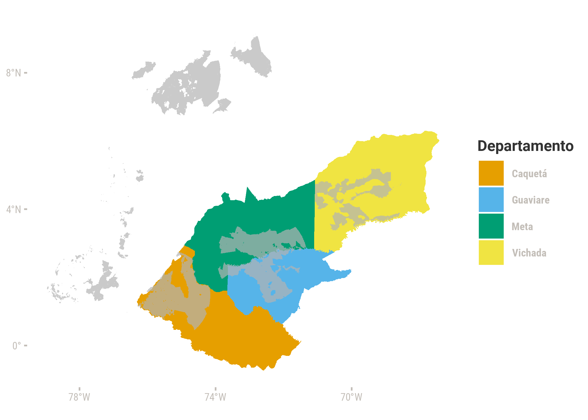
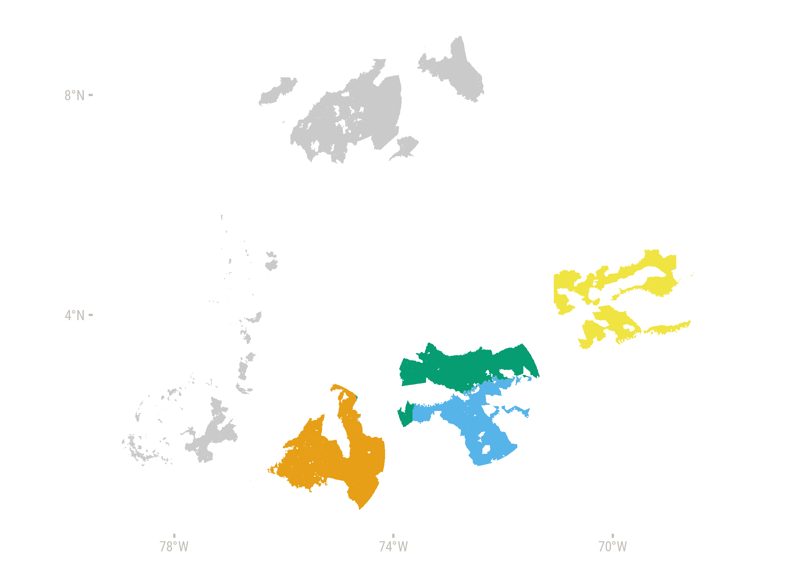
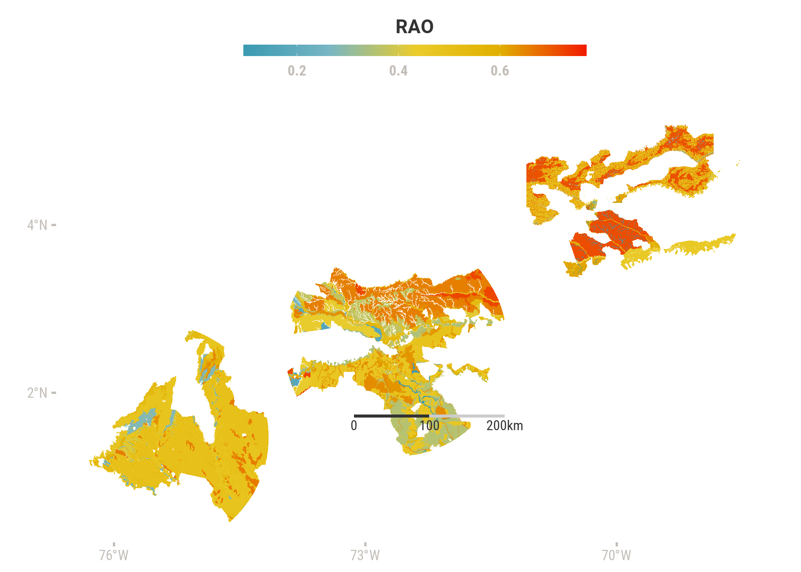
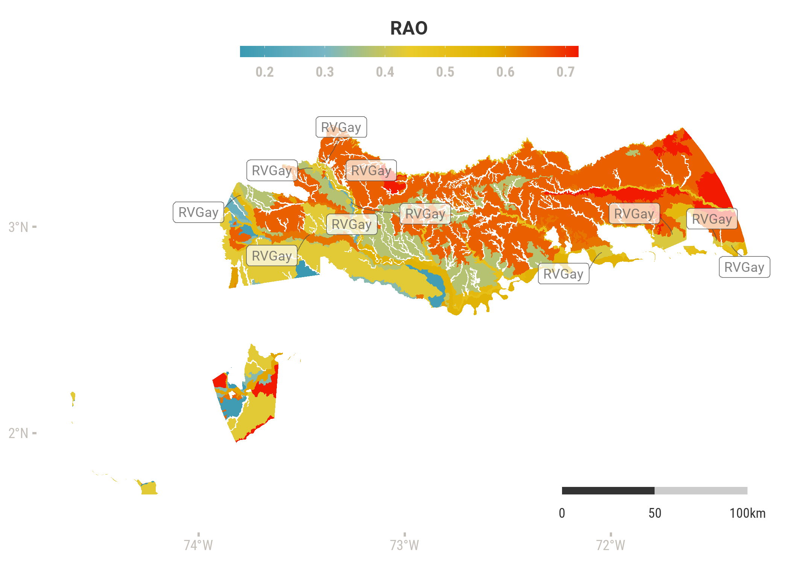

```r
library(tidyverse)
library(rgdal) #leer polígono
library(sf) #manipular objetos espaciales tipo sf
library(colorblindr)
library(showtext) #fuentes de goolge
library(colorspace) #lighten or darken colors
library(ggrepel) #etiquetas 
library(ggsn) #escala gráfica
library(gghalves)
library(wesanderson)


knitr::opts_chunk$set(include = FALSE, echo = FALSE, warning = FALSE, message = FALSE, fig.align="center", fig.showtext = TRUE, fig.retina = 1, dpi = 300, out.width = "70%")

showtext_auto()
```


## Rationale

Los datos de suelo en la toma de decisiones ambientales. Los tipos de datos de suelo posibles. Su representación.

## Los datos

Los polígonos donde se realizaría la aspersión -llamados núcleos en el documento del PECIG(2020) - se obtuvieron de la página web de la Agencia Nacional de Licencias Ambientales (ANLA). La información geográfica de suelos por departamento se obtuvo de los datos abiertos del IGAC en 2019 y 2020. La información de perfiles de suelo se obtuvo de los estudios de suelo del IGAC de los departamentos respectivos, publicados en 2014. Debido a la disponibilidad de datos, se presentan únicamente los casos del núcleo san josé (departamentos Meta, Vichada y Guaviare) y el núcleo caquetá (departamento Caquetá) .


```r
ggplot() + 
  geom_sf(data = deptos %>% 
            filter(NAME_1 %in% c("Meta", "Vichada", "Guaviare", "Caquetá")),
          aes(fill = NAME_1),
          color = NA) +
  geom_sf(data = nucleos, fill = "grey70", color = NA, alpha = 0.7)+
  scale_x_continuous(breaks=c(-78, -74, -70))+
  scale_y_continuous(breaks=c(0,4,8)) +
  scale_fill_OkabeIto()+
  guides(fill = guide_legend( title = "Departamento")) 
```



## Preprocesamiento en QGIS

A los polígonos obtenidos del IGAC se les corrigieron geometrías y se generaron índices espaciales en QGIS. Posteriormente se realizaron las intersecciones de los polígonos de suelos por departamento con los polígonos de núcleos de aspersión, para limitar el objeto de estudio, utilizando la función clip. A los polígonos resultantes se les agregó una campo que especifíca el núcleo.


```r
#plot department clipped to nucleos
ggplot() + 
  geom_sf(data = nucleos, fill = "grey70", color = NA, alpha = 0.7)+
  geom_sf(data = meta_nucleo, color = NA, fill = "#069d73")+
  geom_sf(data = vichada_nucleo, color = NA, fill = "#f0e443")+
  geom_sf(data = guaviare_nucleo, color = NA, fill="#57b4e9")+
  geom_sf(data = caqueta_nucleo, color = NA, fill = "#e69f16")+
  scale_x_continuous(breaks=c(-78, -74, -70))+
  scale_y_continuous(breaks=c(0,4,8))
```



## Indice de pedodiversidad

En los polígonos de suelos resultantes se identifican los códigos de las UCS, los suelos que las conforman y los identificadores de los perfiles de suelos. 

Para estimar la pedodiversidad se utilizó el algoritmo propuesto por Rositter para estimar la similitud entre suelos. La automatización la estoy documentando en otro repositorio (link). Según el algorítmo...

Los polígonos y los índices de pedodiversidad


## Resultados


```r
ggplot() +
  geom_sf(data = meta_RAO, aes(fill = RAO), color = NA )+
  geom_sf(data = guaviare_RAO, aes(fill = RAO),color = NA)+
  geom_sf(data = vichada_RAO, aes(fill = RAO),color = NA)+
  geom_sf(data = caqueta_RAO, aes(fill = RAO),color = NA)+
  scale_fill_gradientn(colours = pal)+
  theme(legend.position = "top")+
  guides(fill = guide_colourbar(title.position = "top",
                                title.hjust = 0.5,
                                barwidth = unit(15,"lines"),
                                barheight = unit(0.5,"lines")))+
  scale_x_continuous(breaks=c(-76, -73, -70))+
  scale_y_continuous(breaks=c(2,4))
```




## Interpretación del dashboard

En el dashboard (link) se presenta una gráfica interactiva 


```r
meta_centroids = st_centroid(meta_RAO)

# En el dashboard, 
ggplot()+
  geom_sf(data = meta_RAO, 
          aes(fill = RAO),
          color = NA)+
  geom_label_repel( data = meta_centroids %>% 
                     filter(UCS_F == "RVGay") %>%
                     distinct(., geometry, .keep_all = TRUE),   
                   aes(label = UCS_F, geometry = geometry),
                   alpha = 0.7,
                   col = "grey30",
                   size = 3,
                   force_pull  = 0.2,
                   max.overlaps = Inf,
                   direction = "both",
                   box.padding = 0.5,
                   stat = "sf_coordinates",
                   family = "roboto",
                   segment.size = 0.3,
                   segment.square = FALSE,
                   segment.curvature = -0.3,
                   segment.angle = 30, 
                   segment.ncp = 10,
                   show.legend = FALSE) +
  theme(legend.position = "top")+
  scale_fill_gradientn(colours = pal)+
  guides(colour = "none",
         fill = guide_colourbar(title.position = "top",
                                title.hjust = 0.5,
                                barwidth = unit(15,"lines"),
                                barheight = unit(0.5,"lines")))+
  scale_x_continuous(breaks=c(-74, -73, -72))+
  scale_y_continuous(breaks=c(2,3))
```




