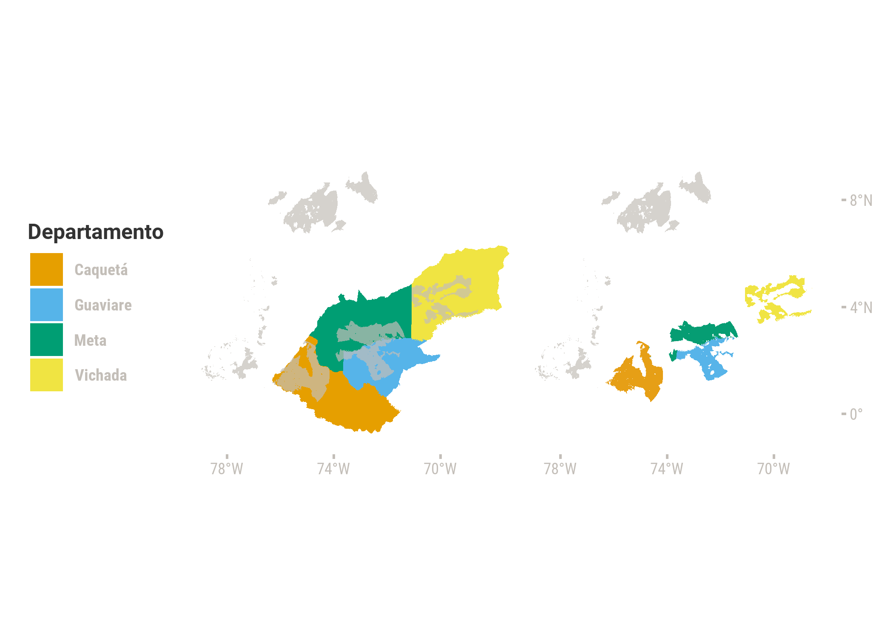
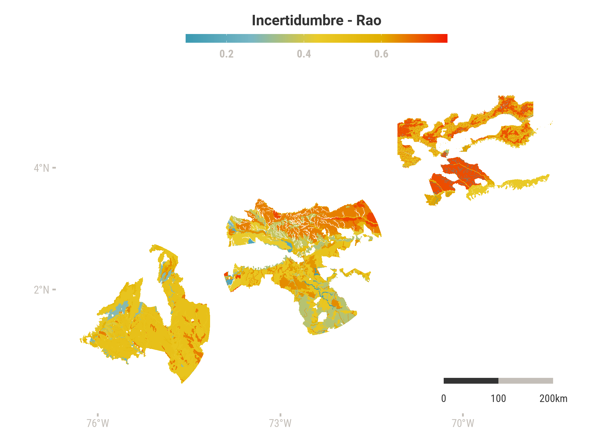
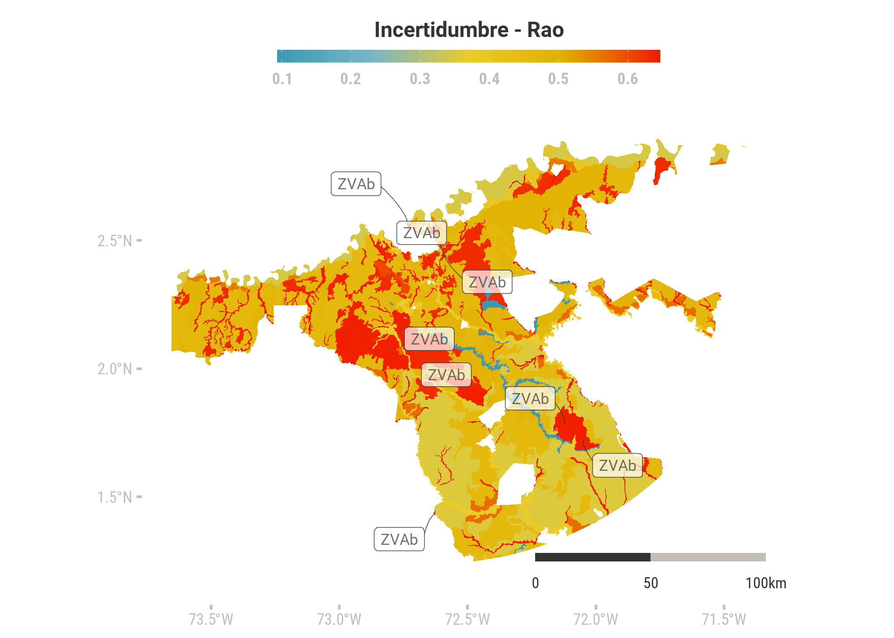

```r
library(tidyverse)
library(sf) #manipular objetos espaciales tipo sf
library(colorblindr)
library(patchwork)
library(showtext) #fuentes de goolge
library(colorspace) #lighten or darken colors
library(ggrepel) #etiquetas 
library(ggsn) #escala gráfica
library(gghalves)
library(wesanderson)


knitr::opts_chunk$set(include = FALSE, echo = FALSE, warning = FALSE, message = FALSE, fig.align="center", fig.showtext = TRUE, fig.retina = 1, dpi = 300, out.width = "85%")

showtext_auto()
```


## Motivación

El Plan de Manejo Ambiental (PMA) del Programa para la Erradicación de Cultivos Ilícitos con Glifosato (PECIG) se modificó en 2019 con el objetivo de reactivar dicho programa, el cual había sido suspendido en 2015 conforme al principio de preacución. Uno de los requisitos del PMA es el análisis de suelos, el cual es relevante para entender el destino ambiental del glifosáto, por ejemplo, debido a la capacidad de los suelos de adsorber, modificar o liberar este pesticida. Los análisis que presenta el PMA se limitan a nombrar las Unidades Cartográficas de Suelos (UCS), sin investigar los suelos que las componen, sus propiedades y manejo, lo cuál tiene consecuencias nocivas para la toma de decisiones ambientales. Mediante el uso de un dashboard interactivo, se espera que la información de suelos en el marco del PECIG se vuelva transparente y asequible a la población.

## Los datos

Los 6 polígonos donde se realizaría la aspersión -llamados núcleos en el PMA del PECIG - se obtuvieron de la página web de la Agencia Nacional de Licencias Ambientales (ANLA). La información geográfica de suelos por departamento se obtuvo de los datos abiertos del IGAC en 2019 y 2020. La información de perfiles de suelo se obtuvo de los estudios de suelo del IGAC de los departamentos respectivos, publicados en 2014. Debido a la disponibilidad de datos de libre acceso, se presentan únicamente los casos del núcleo san josé (departamentos Meta, Vichada y Guaviare) y el núcleo caquetá (departamento Caquetá).


## Preprocesamiento en QGIS

A los polígonos obtenidos del IGAC se les corregí geometrias en QGIS. Posteriormente se realicé las intersecciones de los polígonos de suelos por departamento con los polígonos de núcleos de aspersión, para limitar los objetos de estudio, utilizando la función clip. A los polígonos resultantes se les agregaron campod que especifícan el núcleo y departamento.


```r
p_deptos <- ggplot() + 
  geom_sf(data = deptos %>% 
            filter(NAME_1 %in% c("Meta", "Vichada", "Guaviare", "Caquetá")),
          aes(fill = NAME_1),
          color = NA) +
  geom_sf(data = nucleos, fill = "grey70", color = NA, alpha = 0.7)+
  theme(legend.position = "left")+
  scale_x_continuous(breaks=c(-78, -74, -70))+
  scale_y_continuous(breaks=c(0,4,8)) +
  scale_fill_OkabeIto()+
  guides(fill = guide_legend( title = "Departamento")) +
  coord_sf(xlim = c(-78.7, -68), ylim = c(-1, 9), 
           label_axes = list(bottom = "E", right = NA, left = NA, top = NA),
           clip = "off") 

#plot department clipped to nucleos
p_nucleos <- ggplot() + 
  geom_sf(data = nucleos, fill = "grey70", color = NA, alpha = 0.7)+
  geom_sf(data = meta_nucleo, color = NA, fill = "#069d73")+
  geom_sf(data = vichada_nucleo, color = NA, fill = "#f0e443")+
  geom_sf(data = guaviare_nucleo, color = NA, fill="#57b4e9")+
  geom_sf(data = caqueta_nucleo, color = NA, fill = "#e69f16")+
  scale_x_continuous(breaks=c(-78, -74, -70))+
  scale_y_continuous(breaks=c(0,4,8))+
  coord_sf(xlim = c(-78.7, -68), ylim = c(-1, 9), 
           label_axes = list(bottom = "E", right = "N", left = NA, top = NA),
           clip = "off") 


#layout

p_deptos + p_nucleos
```




## Indices de pedodiversidad

En los polígonos de suelos resultantes se identifican los códigos de las UCS, los suelos que las conforman, el porcentaje que ocupan en la UCS y los identificadores de los perfiles de suelos. 

Para estimar la pedodiversidad se utilizó el algoritmo propuesto por Rositter et al. (2017) para estimar la similitud entre suelos con base en la jerarquía taxonómica. La automatización la estoy documentando en otro repositorio (link). Esta forma de estimación de la similitud entre suelo subestima las diferencias entre suelos de igual nomenclatura y sobreestima las diferencias entre ordenes distintos. Debido a esto, el dashboard incluye también la visualización de la propiedades de suelos de os perfiles que conforman las UCS, en los casos en que estaban disponibles. Las similitudes entre suelos se utilizaron para el calculo de la entropía de RAO, que es una métrica de pedodiversidad conocida, que se puede entender como una medida de incertidumbre o heterogeneidad de suelos en un área (Ibañez 1990).


## Resultados

Se presenta un mapa de cloropletas con los valores de entropía de RAO, que oscilan de 0 a 1, en donde 1 correspnderían a áreas con máxima incertidumbre. Los valores mas altos son cercanos a 0.8. Se observa una tendencia a la alta incertidumbre en los departamentos Vichada y Meta, valores intermedios en Caquetá e incertidumbre baja a moderada (en el rango 0.2 a 0.6) en Guaviare.


```r
ggplot() +
  geom_sf(data = meta_RAO, aes(fill = RAO), color = NA )+
  geom_sf(data = guaviare_RAO, aes(fill = RAO),color = NA)+
  geom_sf(data = vichada_RAO, aes(fill = RAO),color = NA)+
  geom_sf(data = caqueta_RAO, aes(fill = RAO),color = NA)+
  scale_fill_gradientn(colours = pal)+
  ggsn::scalebar(data = meta_RAO, 
           dist = 100, 
           dist_unit = "km",
           transform = TRUE,
           st.dist = 0.05,
           st.color = "grey20",
           st.size = 3,
           height=0.02,
           box.color = NA,
           box.fill = c("grey20","grey80"),
           family = "robotoc")+
  theme(legend.position = "top")+
  guides(fill = guide_colourbar(title.position = "top",
                                title.hjust = 0.5,
                                barwidth = unit(15,"lines"),
                                barheight = unit(0.5,"lines")))+
  scale_x_continuous(breaks=c(-76, -73, -70))+
  scale_y_continuous(breaks=c(2,4))
```




## Interpretación del dashboard

En el dashboard (link) se presenta una gráfica interactiva en la cual se puede explorar el contenido de suelos en diferentes UCS, su significado en términos de incertidumbre y su distribución en los departamentos estudiados. Para su elaboración se tuvieron en cuenta principios de visualización inclusivos: colores aptos para personas con alteraciones visuales, encodificación con colores interpretables como incertidumbre, etiquetado de formas (puntos y polígonos), interactividad y simplificación.


```r
meta_centroids = st_centroid(meta_RAO)

# En el dashboard, 
ggplot()+
  geom_sf(data = meta_RAO, 
          aes(fill = RAO),
          color = NA)+
  geom_label_repel( data = meta_centroids %>% 
                     filter(UCS_F == "RVGay") %>%
                     distinct(., geometry, .keep_all = TRUE),   
                   aes(label = UCS_F, geometry = geometry),
                   alpha = 0.7,
                   col = "grey30",
                   size = 3,
                   force_pull  = 0.2,
                   max.overlaps = Inf,
                   direction = "both",
                   box.padding = 0.5,
                   stat = "sf_coordinates",
                   family = "roboto",
                   segment.size = 0.3,
                   segment.square = FALSE,
                   segment.curvature = -0.3,
                   segment.angle = 30, 
                   segment.ncp = 10,
                   show.legend = FALSE) +
  ggsn::scalebar(data = meta_RAO, 
           dist = 50, 
           dist_unit = "km",
           transform = TRUE,
           st.dist = 0.05,
           st.color = "grey20",
           st.size = 3,
           height=0.02,
           box.color = NA,
           box.fill = c("grey20","grey80"),
           family = "robotoc")+
  theme(legend.position = "top")+
  scale_fill_gradientn(colours = pal)+
  guides(colour = "none",
         fill = guide_colourbar(title.position = "top",
                                title.hjust = 0.5,
                                barwidth = unit(15,"lines"),
                                barheight = unit(0.5,"lines")))+
  scale_x_continuous(breaks=c(-74, -73, -72))+
  scale_y_continuous(breaks=c(2,3))
```




